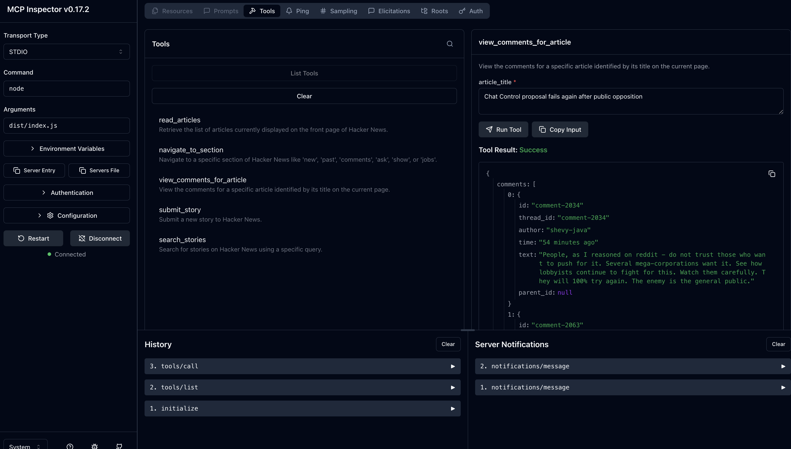

# mcpkit

> Easy setup for MCPs with Browserbase. Run browser automation anywhere with just an API key.

## What is mcpkit?

**mcpkit** is a CLI tool that generates [Stagehand](https://github.com/browserbase/stagehand) MCP servers for any website. With this, an LLM can do any kind of web flow.

## Quick Start

### Installation

```bash
npm install -g mcpkit
```

### Setup

Set up your Browserbase API key and llm model secrets:
```bash
mcpkit secrets
```

### Create Your First MCP Server

```bash
# Create an MCP server for any website
mcpkit create https://mcpkit.sh

# Or use interactive mode
mcpkit create
```
At some point in the above, you will be prompted to sign in via a Browserbase session.

## CLI Commands

### `mcpkit create <url>`
Generate an MCP server for a website with AI-powered discovery.

**Arguments:**
- `url` (optional): The website URL. If omitted, you'll be prompted interactively.

**Examples:**
```bash
mcpkit create https://news.ycombinator.com
mcpkit create  # Interactive mode
```

### `mcpkit contexts`
Manage saved authentication contexts for websites.

**Actions:**
- `list`: Show all saved contexts
- `show <domain>`: Display details for a specific context
- `delete <domain>`: Remove a context

**Examples:**
```bash
mcpkit contexts list
mcpkit contexts show github.com
mcpkit contexts delete mcpkit.sh
mcpkit contexts create mcpkit.sh
```

### `mcpkit secrets`
Set up and manage secrets for browserbase, as well as your model of choice

**Examples:**
```bash
mcpkit secrets  # Interactive setup
```

### `mcpkit help`
Display help information and available commands.

### `mcpkit version`
Show the current version of mcpkit.

**Note:** For detailed documentation, examples, and guides, visit **[mcpkit.sh](https://mcpkit.sh)**

## Testing Generated MCP Servers

After running `mcpkit create`, test your generated server:

1. Navigate to the created folder:
```bash
cd mcp-stagehand-{domain}/
```

3. Test with the MCP Inspector:
```bash
npx @modelcontextprotocol/inspector node dist/index.js
```

You should see a screen like this:



Alternatively, you can install into claude code with

```bash
claude mcp add --transport stdio "your-mcp-name-here" -- node dist/index.js
```


## Contributing

Contributions are welcome! Please feel free to submit a Pull Request.

### Development Setup

Within the repo, run:

```bash
npm install && npm run build && npm link
```

Now you can run a local instance of mcpkit for testing.

## License

MIT
